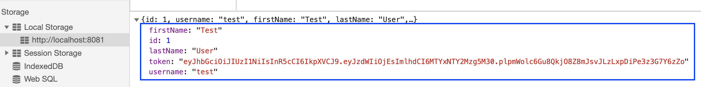

# Testing Logins Efficiently

## 🧠You will learn:

✅How to login without a UI using a HTML web forms 

✅How to login without a UI using JWT

## HTML Web Form

### ⚙️Setup

>We will use https://github.com/nadvolod/cypress-example-recipes only for login testing

1. Stop the other processes from previous exercises `Ctrl + C`
2. Fork https://github.com/nadvolod/cypress-example-recipes
3. Clone your fork to your machine
1. Start cypress and the app


```bash
cd cypress-example-recipes
npm install
cd examples/logging-in__html-web-forms/
npm run dev
```

>We will use https://github.com/nadvolod/cypress-example-recipes only for login testing

### Exploring the app

Our simple web app is protected by a HTML web form

1. Try to open the URL `http://localhost:7077/`
2. Try to login with valid credentials `jane.lane` and `password123`. Pay attention to the requests and behavior of the application
3. Also try to login with invalid credentials.

Some expected app behaviors
1. /admin only allowed for authenticated users
2. /users only allowed for authenticated users
2. /dashboard only allowed for authenticated users
3. Only user `jane.lane` and `password123` can access the app


Open `inneficient.spec.js` 

### ❓What are the problems with these tests❓

UI tests in general are inneficient! Hence, so many models exist to discourage us from writing so many UI tests (autoamtion pyramid, automation trophy, automation diamond...)


So let's improve our tests...

### 🏋️‍♀️Exercise

1. Open `exercise.spec.js`
1. Create a test that can visit `/dashboard` without a UI login (We'll do this together)
2. Create a test that can visit `/users` without a UI login
3. Create a test that can visit `/admin` without a UI login

💡 You already have some helpful code to make your life easier 

### Advantages/Disadvantages
✅Fast

✅Reliable

✖️Need to learn how your API works (maybe a good thing)

## 📔Summary

1. We bypassed one login using `sessionStorage` in a browser. This case is not typical as most websites don't have authentication code that happens in the front-end.
2. We bypassed another login using an HTML Web Form. This is a common approach that we can use to tackle other types of logins

---

## JSON Web Token (JWT)

### ⚙️Setup
1. `Ctrl + C` to kill all of the processess running from previous session (server and cypress)
2. `cd ../logging-in_jwt`
3. `npm run dev`
4. App runs on http://localhost:8081/

### The SUT

*Authenticate User:* 


POST to http://localhost:4000/users/authenticate

*Get list of users:*

 GET to http://localhost:4000/users with a bearer token as auth

Explore the application at `http://localhost:8081/` and notice the behavior of authentication

### How does [JWT](https://jwt.io/introduction) work?
1. Form fires `handleSubmit()`
2. Reads form values
3. Fires a web request for authentication

```js
//LoginPage.vue
if (username && password) {
    dispatch('authentication/login', { username, password });
}
```
4. Save JWT token to local storage. No cookies. 

```js
//user.service.js
.then((user) => {
// login successful if there's a jwt token in the response
if (user.token) {
    // store user details and jwt token in local storage to keep user logged in between page refreshes
    localStorage.setItem('user', JSON.stringify(user))
}
```


[Building and testing an auth API with JWT tutorial](https://www.youtube.com/watch?v=klIAT82UtVs)

### 🏋️‍♀️Atomic login tests (25min)

Open `cypress/integration/exercise.spec.js`
Your challenge is to create 2 tests:
1. Create a test to login with a JWT and assert that user is successfully logged in
2. Assert that a user can successfully log out. You're not allowed to login through the UI

💡 JWT authentication is already implemented for you

## 📝Summary

✅Pretty much all authentication can be bypassed without using a UI

✅Authenticating using non-UI methods is more stable and efficient

✅We learned 3 types of authentication: HTML Web forms, JWT, directly setting session storage (not realistic)

## 📔More Resources

There are numerous other ways that we can authenticate:
1. SSO
2. Using app code
3. XHR web forms
4. CSRF tokens
5. Basic auth

[Learn more by looking at the logging-in examples folders](https://github.com/nadvolod/cypress-example-recipes/tree/master/examples)