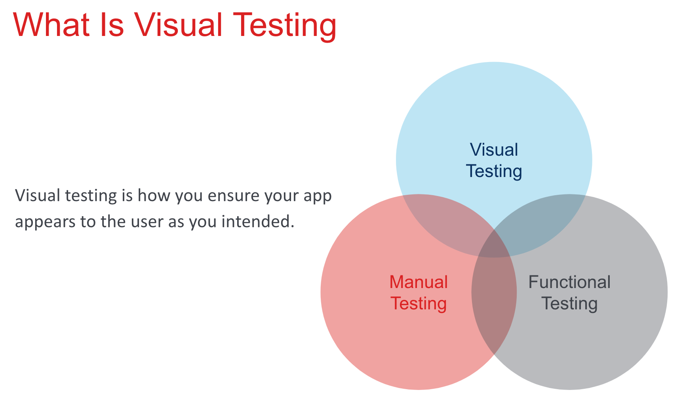
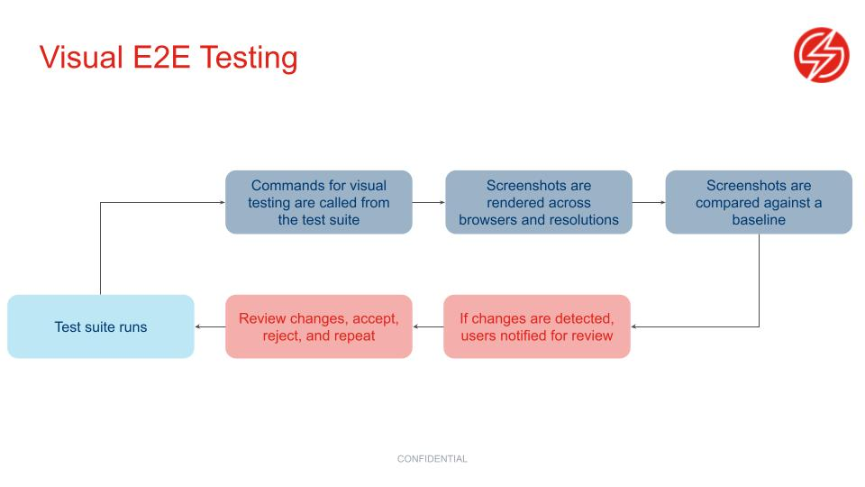

# Visual E2E Testing

## 🧠You will learn

✅What is visual E2E testing? 

✅How to implement visual e2e testing for a web app

## 🧪Current Test Coverage

[Look here](TEST-COVERAGE.md)

---

## ❓How do we check to make sure that the app looks as expected on web and mobile?

---





### Advantages of visual tests

✅ Easier than e2e tests

✅ Validate an entire page in a single LOC

✅ Check how an app looks in different Browsers/Resolutions

✅ More stable than e2e tests

✅ Can help reduce the size of e2e suite

[Deeper discussion of visual testing](https://docs.google.com/presentation/d/13jYXXoKb36aFt1HLnNnAmsPqw9yaFhVrB4iFH_5_WkI/edit#slide=id.gcc181d5a54_0_284)

## Our tools

### [WebdriverIO](https://webdriver.io/)
Next-gen browser and mobile automation test framework for Node.js

### [Screener](https://screener.io/)
Automatically detect visual regressions across your UI

## Set up a visual test

follow along

1. Create a new file `my-react-app/test/specs/exercise.spec.js`
2. Paste the following code

```javascript

describe('My app', () => {
    it('should look correct', async () => {
        await browser.url('');
        await browser.execute('/*@visual.init*/', 'My React App');
        await browser.execute('/*@visual.snapshot*/', 'Home Page');

        const result = await browser.execute('/*@visual.end*/');
        expect(result.message).toBeNull();
    });
});

```
3. `cd testing-for-charity/my-react-app`
4. `npm run test:visual`
5. View your results in Screener.io 

[Let's fill out the Test coverage](./TEST-COVERAGE.md)

---

### 🏋️‍♀️❓ Let's change our image, what tests should that break❓

---

We're going to update the React image to something better. What tests should break?

1. Drag n drop a new image to the `testing-for-charity/my-react-app/src`
2. In `App.js`, Fix the path of the image to match your new image name `import logo from './mia.jpg';` 
2. Save all files
3. Stop the React app `ctrl + C` in the server terminal
4. Restart the app with `npm start`
5. Rerun the visual tests with `npm run test:visual`
6. Analyze the results in Screener dashboard

## Add a step to CI

In your `yml` add this code at the end

```yml
- name: Run visual tests 👁
      run: |
        cd testing-for-charity/my-react-app
        npm run test:visual
```

Push the code to Github

## 📝Summary

✅Visual e2e testing is a simple and efficient way to ensure visual consistency cross-platform and cross-OS

✅We used WebdriverIO + Screener.io to write our visual e2e tests

## ⏭️[Let's make our testing more efficient with component tests](./COMPONENT-TESTS.md)
